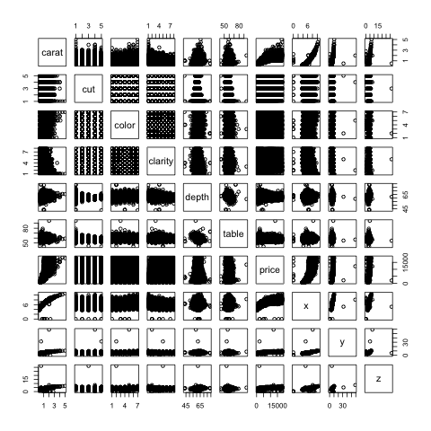
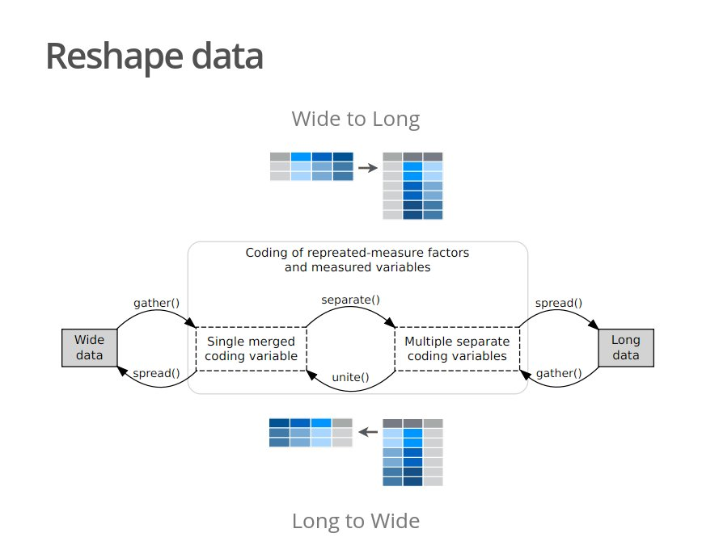

## Setup. 

Si l'un de ces packages n'a pas encore été installé sur votre machine, ou que vous en possédez une version ancienne, il faut entrer la commande correspondante après l'avoir dé-commentée.

```{r}
# Obligatoire
# install.packages("ggplot2")

# Facultatif
# install.packages("RColorBrewer")
# install.packages("hexbin")
# install.packages("maps")
```

----

Dans tous les cas, il est nécessaire au lancement de charger le ou les packages.

```{r}
library(ggplot2)

library(RColorBrewer)
library(hexbin)
library(maps)
```

```{r, echo = FALSE}
# Indispensable pour exporter le notebook/les slides sans message d'erreur !?
library(knitr)
opts_knit$set(root.dir = '/')
```


## Un jeu de données interne à ggplot2

Nous utilisons un jeu de données interne à ggplot2 contenant le prix ainsi que d'autres attributs de 53 940 diamants.

Les commandes suivantes permettent de prendre connaissance du jeu de données.

```{r}
# help(diamonds)

# View(diamonds)
```

----

```{r}
head(diamonds)
```

----

```{r}
str(diamonds)
```

----

On ne va garder qu'une entrée sur dix de ce jeu de données afin de rendre les calculs plus rapides et les graphiques moins chargés.

```{r}
diam <- diamonds[seq(10, nrow(diamonds), 10),]
```

## Charger les données dans ggplot

**Remarque** : à partir d'ici, nous parlons principalement de ggplot sans le "2" car il va s'agir de la fonction "ggplot". 

Le "2" n'est utilisé que dans le nom du package. 

Et oui, ggplot1 [existe](https://github.com/hadley/ggplot1).

----

### On charge les données

*Attention ! L'input doit toujours être un data frame !*

```{r}
g <- ggplot(diam)
```

----

```{r}
g
```

----

Contrairement à la fonction `plot`, qui bricole un visuel lorsqu'on entre la commande `plot(diamonds)`, avec `ggplot` il ne se passe rien.

Juste un grand carré gris.

----

Le résultat de `plot(diamonds)`.



----

La commande de base `plot(diamonds)` considère toutes les variables du data frame et les croise entre elles - numériques comme ordinales - pour un résultat illisible et inutile.

Qu'obtient-on avec la commande `ggplot` ?

----

```{r}
str(g)
```

----

On retrouve le data frame contenant nos données, ainsi que les différents éléments propres à l'approche *grammaticale* des graphiques proposée par `ggplot2`, pour l'instant vides :

* layers

* scales

* mapping

* theme

* coordinates

* facet

----

À ce stade, le graphe est vide car nous n'avons défini ni mapping ni géométries (voir figure suivante).

----

```{r}
g <- ggplot(diam)
g
```

## Mapping

### Avec un mapping mais sans géométrie

cf. figure suivante.

Pour rappel : 'carat' et 'price' sont des variables continues.

----

```{r}
ggplot(diam, aes(x = carat, y = price)) 
```

----

On remarque que les échelles et les labels des axes sont déjà posés. 

`ggplot` attend maintenant de savoir quoi dessiner.

----

### Avec une géométrie mais sans mapping

Pas de figure...

```{r, error = TRUE}
ggplot(diam) + geom_point()
```

----

Cette fois, ggplot n'a pas trouvé de mapping lui indiquant où poser son dessin, d'où l'erreur.

----

### Avec un mapping et une géométrie

```{r}
ggplot(diam, aes(x = carat, y = price)) + geom_point()
```

----

Pour comparaison, la commande la plus simple permettant d'obtenir (à peu près) le même résultat avec le package de base.

```{r}
plot(diam$carat, diam$price)
```

----

Les échelles sont justes et les points sont bien situés, mais c'est tout et c'est moche.

----

C'est là le principe de ggplot : à partir de maintenant nous pouvons faire varier les éléments graphiques sans avoir à toucher aux données.

Par exemple, une interpolation.

----

```{r}
ggplot(diam, aes(x = carat, y = price)) + geom_smooth()
```

## Superposer des layers

Il suffit de les additionner pour les superposer.

**Attention** au '+' à mettre à la fin de la ligne et pas au début.

----

```{r}
ggplot(diam, aes(x = carat, y = price)) + 
  geom_point() + 
  geom_smooth()
```

----

Attention, l'ordre des géométries a une influence sur le graphique !

----

```{r}
ggplot(diam, aes(x = carat, y = price)) + 
  geom_smooth() + 
  geom_point()
```

----

Dans le graphique précédent, la courbe d'interpolation a été dessinée avant les points.

Ainsi, elle apparaît dans la figure cachée sous ces derniers.

## Différents mappings

Le mapping peut se faire à plusieurs endroits : 

* Dans `ggplot()`, ce qui a pour effet d'appliquer le mapping à tous les autres éléments.

* Dans les éléments graphiques eux-mêmes.

----

### Tout dans ggplot

```{r}
ggplot(diam, aes(x = carat, y = price)) + geom_point()
```

----

### Dans les deux

```{r}
ggplot(diam, aes(x = carat)) + geom_point(aes(y = price))
```

----

### Tout dans la géométrie

```{r}
ggplot(diam) + geom_point(aes(x = carat, y = price))
```

----

Bref, on peut mapper de nombreuses variables, en une seule fois, directement dans `ggplot` et elles seront reprises par les autres éléments. 

Par exemple, l'attribut `color` de `geom_point`. 

*Remarque* : la variable 'clarity' est ordinale.

----

```{r}
ggplot(diam, aes(x = carat, y = price, color = clarity)) + 
  geom_point()
```

----

Grâce à ce seul mapping, `ggplot` attribue à chaque modalité une couleur, attribue aux points la couleur correspondante, et génère dans la foulée une légende (une des angoisses lorsqu'on travaille avec les commandes de base).

Pour l'anecdote, nous aurions obtenu le même résultat en faisant le mapping dans `geom_point`.

----

```{r}
ggplot(diam, aes(x = carat, y = price)) + 
  geom_point(aes(color = clarity))
```

----

Attention à ne pas oublier de faire le mapping, c'est-à-dire d'utiliser la fonction `aes()`, sinon ça ne fonctionnera pas !

```{r, error = TRUE}
ggplot(diam, aes(x = carat, y = price)) + 
  geom_point(color = clarity)
```

----

On trouve toutes les géométries disponibles ainsi que de nombreuses autres ressources indispensables dans l'**indispensable** [cheat sheet de ggplot2](https://www.rstudio.com/wp-content/uploads/2015/03/ggplot2-cheatsheet.pdf) !

----

### Variables et transformations, discrètes et continues

C'est hasardeux, mais on peut également appliquer une transformation continue (`size`) à une variable ordinale (`cut`).

----

```{r}
ggplot(diam, aes(x = carat, y = price, color = clarity, size = cut)) + 
  geom_point()
```

----

Toutefois, il est recommandé d'appliquer une transformation continue (`size`) à une variable continue (par exemple `depth`) et une transformation discrète comme la couleur ou la forme (`shape`) à une variable discrète (par exemple `cut`).

----

```{r}
ggplot(diam, aes(x = carat, y = price, color = clarity, shape = cut)) + 
  geom_point()
```

----

Détail qui a son importance dans l'exemple suivant : la fonction `geom_smooth` va hériter du mapping sur la couleur.

*Note* : "se = FALSE" empêche l'affichage de l'incertitude.

----

```{r}
ggplot(diam, aes(x = carat, y = price, color = clarity)) + 
  geom_point() + 
  geom_smooth(se = FALSE)
```

----

Pour le mapping sur la forme (au lieu de la couleur), on repassera.

----

```{r}
ggplot(diam, aes(x = carat, y = price, shape = cut)) + 
  geom_point() + 
  geom_smooth(se = FALSE)
```

----

Et si l'on prend en considération les deux en même temps, ça peut mener à la catastrophe.

----

```{r}
ggplot(diam, aes(x = carat, y = price, color = clarity, shape = cut)) + 
  geom_point() + 
  geom_smooth(se = FALSE)
```

----

Le même code que précédemment, avec cette fois le graphique à la place du message d'erreur.

```{r, warning = FALSE}
ggplot(diam, aes(x = carat, y = price, color = clarity, shape = cut)) + 
  geom_point() + geom_smooth(se = FALSE)
```

----

Il est nécessaire de redistribuer le mapping plus subtilement.

----

```{r}
ggplot(diam, aes(x = carat, y = price, color = clarity)) + 
  geom_point(aes(shape = cut)) + 
  geom_smooth(se = FALSE)
```

----

D'autres exemples concernant les attributs des éléments géométriques.

----

### Transformation continue, variable continue

```{r}
ggplot(diam, aes(x = carat, y = price, color = clarity, size = depth)) + 
  geom_point()
```

----

Il est possible évidemment de modifier plus subtilement la taille des sommets lorsqu'on fait un mapping dessus, si les valeurs par défaut ne nous plaisent pas. 

En général, cela passe par les fonctions `scale`. 

Elles commencent par `scale_` (voir la cheat sheet). 

Nous reviendrons plus en détail là-dessus.

Dans la figure suivante, nous donnons des valeurs minimales et maximales pour la taille des sommets.

----

```{r}
ggplot(diam, aes(x = carat, y = price, color = clarity, size = depth)) + 
  geom_point() + 
  scale_size(range = c(1,3))
```

----

*Remarque* : l'effet est difficile à observer car la variance est très petite.

```{r}
summary(diam$depth)
sd(diam$depth)
```

----

Au passage, remarquons que l'on peut aussi utiliser l'attribut `size` de `geom_point` sans mapping.

----

```{r}
ggplot(diam, aes(x = carat, y = price, color = clarity)) + 
  geom_point(size = 1)
```

----

Dans ce cas, la taille des points est considérée hors mapping et donc indépendamment d'une quelconque variable.

----

Remarquons également l'organisation hiérarchique des mappings et des transformations : dans l'exemple qui suit, la variable  `depth` est tout d'abord mappée sur la taille des sommets. 

Puis, dans `geom_point`, on lui attribue une valeur fixe. 

Arrivée ensuite, c'est cette dernière qui l'emporte sur le mapping initial.

----

```{r}
ggplot(diam, aes(x = carat, y = price, color = clarity, size = depth)) + 
  geom_point(size = 1)
```

----

Au passage, la modification du titre en légende dépend de la fonction `scale` correspondante (ici `scale_size`).

C'est logique, mais contre-intuitif pour qui aura passé beaucoup (trop ?) de temps avec les commandes graphiques de base dans R.

----

```{r}
ggplot(diam, aes(x = carat, y = price, color = clarity, size = depth)) + 
  geom_point() + 
  scale_size("DEPTH", range = c(1,3))
```

----

## Bilan intermédiaire

Nous avons vu comment :

* Charger les données.

* Faire un mapping.

* Superposer une ou plusieurs géométries.

----

Il nous reste à découvrir :

* Le facettage.

* Les échelles.

* Les annotations.

* Les types de graphiques autres que les *scatterplots*.

* Comment sauver un graphique.

* Comment bien préparer ses données.

## Le facettage

Attention ! Ceci s'applique à des variables discrètes.

Le facettage divise le jeu de données en fonction des catégories d'une variable.

Dans un sens… 

----

```{r}
ggplot(diam, aes(x = carat, y = price)) + 
  geom_point() +
  facet_grid(. ~ cut) 
```

----

… et dans l'autre.

(Remarquez la position inversée de la variable `cut` dans `facet_grid()`.)

----

```{r}
ggplot(diam, aes(x = carat, y = price)) + 
  geom_point() +
  facet_grid(cut ~ .) 
```

----

En croisant deux variables discrètes.

----

```{r}
ggplot(diam, aes(x = carat, y = price)) + 
  geom_point() +
  facet_grid(color ~ clarity) 
```

----

Finalement, en croisant deux variables discrètes, avec un mapping sur la couleur.

----

```{r}
ggplot(diam, aes(x = carat, y = price, color = cut)) + 
  geom_point() +
  facet_grid(color ~ clarity) 
```

----

Il y a une autre option de facettage lorsqu'on n'utilise qu'une seule variable discrète : `facet_wrap`.

Dans ce cas, remarquez que nous n'utilisons plus le point (.) avant le tilde (~).

----

```{r}
ggplot(diam, aes(x = carat, y = price)) + 
  geom_point() +
  facet_wrap(~ clarity) 
```


## Les échelles

Elles commencent toutes par `scale_`

Ensuite, on complète avec le nom de la variable concernée.

----


scale_alpha scale_alpha_continuous scale_alpha_discrete scale_alpha_identity scale_alpha_manual scale_color_brewer scale_color_continuous scale_color_discrete scale_color_distiller scale_color_gradient scale_color_gradient2 scale_color_gradientn scale_color_grey scale_color_hue scale_color_identity scale_color_manual scale_colour_brewer scale_colour_continuous scale_colour_date scale_colour_datetime scale_colour_discrete scale_colour_distiller scale_colour_gradient scale_colour_gradient2 scale_colour_gradientn scale_colour_grey scale_colour_hue scale_colour_identity scale_colour_manual scale_continuous scale_date scale_fill_brewer scale_fill_continuous scale_fill_date scale_fill_datetime scale_fill_discrete scale_fill_distiller scale_fill_gradient scale_fill_gradient2 scale_fill_gradientn scale_fill_grey scale_fill_hue scale_fill_identity scale_fill_manual scale_identity scale_linetype scale_linetype_continuous scale_linetype_discrete scale_linetype_identity scale_linetype_manual scale_manual scale_radius scale_shape scale_shape_continuous scale_shape_discrete scale_shape_identity scale_shape_manual scale_size scale_size_area scale_size_continuous scale_size_date scale_size_datetime scale_size_discrete scale_size_identity scale_size_manual scale_x_continuous scale_x_date scale_x_datetime scale_x_discrete scale_x_log10 scale_x_reverse scale_x_sqrt scale_y_continuous scale_y_date scale_y_datetime scale_y_discrete scale_y_log10	scale_y_reverse scale_y_sqrt

----

Par exemple, si l'on travaille sur la couleur, on pourra faire varier la palette des couleurs en modifiant le nom de l'échelle. Faites le test en écrivant scale_color_ dans la console puis en pressant sur la touche tab pour voir les suggestions…

----

En gris 

```{r}
ggplot(diam, aes(x = carat, y = price, color = clarity)) + 
  geom_point() +
  scale_color_grey()
```

----

La version par défaut.

```{r}
ggplot(diam, aes(x = carat, y = price, color = clarity)) + 
  geom_point() +
  scale_color_discrete()
```

----

ColorBrewer, nommée d'après une de ses auteurs, Cnythia Brewer, est une librairie de couleurs précalculées qui s'accordent bien.

On peut les utiliser ici avec la fonction `scale_color_brewer`.

----

```{r}
ggplot(diam, aes(x = carat, y = price, color = clarity)) + 
  geom_point() +
  scale_color_brewer()
```

----

En changeant de palette.

----

```{r}
ggplot(diam, aes(x = carat, y = price, color = clarity)) + 
  geom_point() +
  scale_color_brewer(palette = 2)
```

----

Attention si vous utilisez la mauvaise échelle : soit il ne se passera rien (comme dans la figure suivante), soit il y aura un message d'erreur.

----

```{r}
ggplot(diam, aes(x = carat, y = price, color = clarity)) + 
  geom_point() +
  scale_fill_brewer(palette = 2)
```

----

Dans la figure suivante, nous changeons la forme utilisée pour dessiner les points afin qu'il y ait un pourtour (`color`) et un contenu (`fill`).

Cette transformation a été effectuée en donnant comme instruction que les points doivent changer de forme (indépendamment de toute variable).

Nous en profitons pour dessiner l'intérieur. Quelle fonction faut-il utiliser ?

----

```{r}
ggplot(diam, aes(x = carat, y = price, fill = clarity)) + 
  geom_point(shape = 21) +
  scale_fill_brewer(palette = 2)
```

----

Mais les échelles, ça ne concerne pas seulement l'intérieur du graphique.

Nous utilisons également des échelles sur les axes.

----

```{r}
ggplot(diam, aes(x = carat, y = price, color = clarity)) + 
  geom_point() + 
  scale_x_continuous(breaks = c(1,3), minor_breaks = c(sqrt(2), pi)) +
  scale_y_continuous(breaks = sample(20000, 10))
```

----

Échelle logarithmique FTW.

----

```{r}
ggplot(diam, aes(x = carat, y = price, color = clarity)) + 
  geom_point() + 
  scale_y_log10()
```


## Les annotations

Via un mapping, par exemple pour un MDS.

----

```{r}
ggplot(diam, aes(x = carat, y = price, label = clarity)) + 
  geom_text()
```

----

L'annotation manuelle est possible, à l'ancienne, mais pas forcément recommandée.

----

```{r}
ggplot(diam, aes(x = carat, y = price, color = clarity)) + 
  geom_point() +
  annotate("text", x = 3.5, y = 10000, label = "HELLO")
```


## D'autres types de graphiques

C'est la seule fois que nous voyons une transformation statistique dans cette présentation (malheureusement).

Ce sont les fonctions commençant par `stat_`.

Pour plus d'infos, voir la cheat sheet.

----

```{r}
ggplot(diam, aes(price)) +
  geom_area(stat = "bin")
```

----

```{r}
ggplot(diam, aes(price)) +
  geom_density(kernel = "gaussian")
```

----

```{r}
ggplot(diam, aes(price)) +
  geom_histogram(binwidth = 30)
```

----

Avec une variable discrète, cette fois.

```{r}
ggplot(diam, aes(color)) +
  geom_bar()
```

----

Une variable discrète et une variable continue.

```{r}
ggplot(diam, aes(x = color, y = price)) +
  geom_boxplot()
```

----

Deux variables discrètes.

```{r}
ggplot(diam, aes(x = cut, y = color)) +
  geom_count()
```

----

```{r}
ggplot(diamonds, aes(x=price, fill=cut)) + 
  geom_histogram()
```

----

Distributions bi-variées.

```{r}
ggplot(diamonds, aes(carat, price)) +
  geom_bin2d(binwidth = c(0.25, 500))
```

----

```{r}
ggplot(diamonds, aes(carat, price)) +
  geom_hex()
```


## Les thèmes

C'est `ggtitle` pour choisir un titre.

----

```{r}
ggplot(diam, aes(x = carat, y = price, color = clarity)) + 
  geom_point() + 
  ggtitle("Mon joli graphique")
```

----

Et, classique pour une fois, `xlab` et `ylab` pour changer les noms des axes.

----

```{r}
ggplot(diam, aes(x = carat, y = price, color = clarity)) + 
  geom_point() + 
  xlab("Ma jolie abscisse") + 
  ylab("Ma jolie ordonnée")
```

----

Pour varier les thèmes : `theme_`.

----

```{r}
ggplot(diam, aes(x = carat, y = price, color = clarity)) + 
  geom_point() +
  theme_bw()
```

----

```{r}
ggplot(diam, aes(x = carat, y = price, color = clarity)) + 
  geom_point() +
  theme_dark()
```

----

```{r}
ggplot(diam, aes(x = carat, y = price, color = clarity)) + 
  geom_point() +
  theme_minimal()
```

## Sauver un graphique

```{r}
ggsave
```

----

Par exemple 

`ggsave("plot.pdf", width = 7, height = 7)`

## Bien préparer ses données

«Tidy data is a standard way of mapping the meaning of a dataset to its structure.» 

«A dataset is messy or tidy depending on how rows, columns and tables are matched up with observations, variables and types.» 

----

«In tidy data:

1. Each variable forms a column.
2. Each observation forms a row.
3. Each type of observational unit forms a table.»

Source :

```{r}
# library(tidyr)
# vignette("tidy-data")
```

----

Le format *tidy*, ou *long form*, est fortement recommandé dans `ggplot2`.

La slide suivante est empruntée à [Frederik Aust](https://twitter.com/FrederikAust/status/789101346595151872).

----



## Bonus !

* Réaliser des cartes avec ggplot2.

* Deux [extensions](https://www.ggplot2-exts.org/). 
  
## Réaliser des cartes

```{r}
data <- data.frame(murder = USArrests$Murder, state = tolower(rownames(USArrests)))
map <- map_data("state")
k <- ggplot(data, aes(fill = murder))
k <- k + 
  geom_map(aes(map_id = state), map = map) + 
  expand_limits(x = map$long, y = map$lat)
```

----

```{r}
k
```


## gganimate

```{r}
# devtools::install_github("dgrtwo/gganimate")
# install.packages("gapminder")
library(gganimate)
library(gapminder)
theme_set(theme_bw())
p <- ggplot(gapminder, aes(gdpPercap, lifeExp, size = pop, color = continent, frame = year)) +
  geom_point() +
  scale_x_log10()
```

----

```{r}
gg_animate(p)
```

## Interactivité

Voir exemple [ici](https://gist.github.com/jcheng5/3239667).


